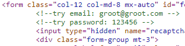
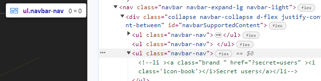
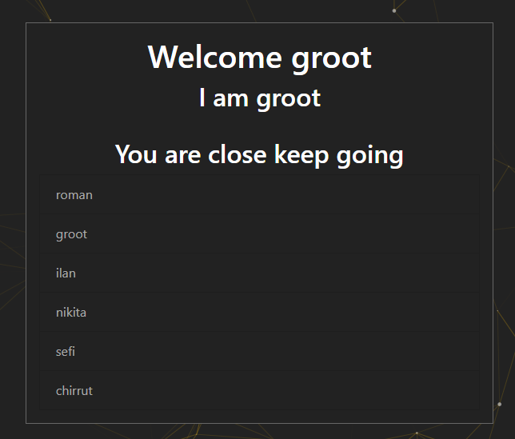

# EnumUsers
## Challenge Description: 
A startup company created a new login page. Before publishing it, they gave you the task to perform penetration testing on their website and check if a non-existing user can log in as an admin user. 
#### Your goals:  
☛ Find a way in to the admin account. 

## Process:
Inspect the page and use the username and password that are hidden as a remark.  
  
 
 After logging into the user, we can inspect the page again and we will see this: 

 Add the '?secret=users' to the URL to look like this '/index.php?secret=users' and you will be presented with a list of all available users. 
  
You can try using Burp Suite to get the correct response. 
You can also use the 'cookie editor' extention to edit the current name and uid of the user. 
The name we are looking for is 'chirrut' and the correct uid is 10. 

Upon changing them you will be presented with the flag

 
        
Hidden Flag
 
          
    

