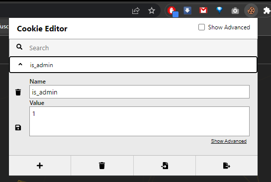
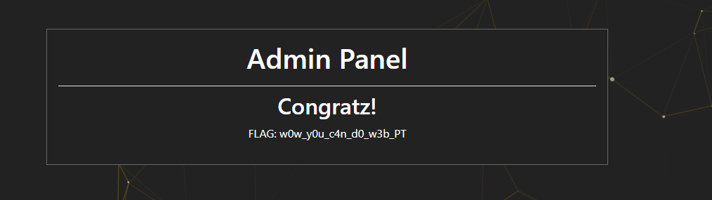

# HintHintHint
## Challenge Description:

The company's new web developer messed things up. He lost the secret flag, and no one can find it. 
Help us find the flag before he does, so we can take control of the system. 

#### Your goals 
☛ Gain access to the Admin Panel.

## Process:
Look at the URL of the site.  
Add '/admin.php' to the URL. 

Open the cookie editor extension or through the 'inspect' tool and change the value of 'is_admin' from 0 to 1. 
 
Refresh the page and the flag will appear  

 
        
Hidden Flag
 
          
    

