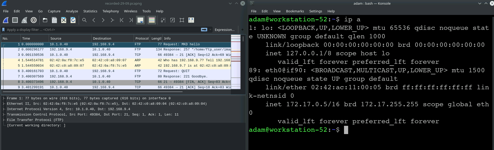
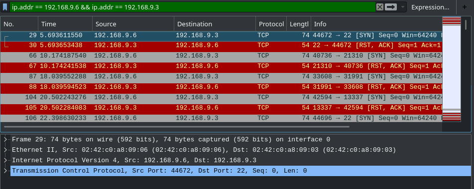
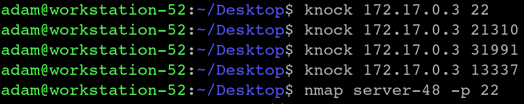
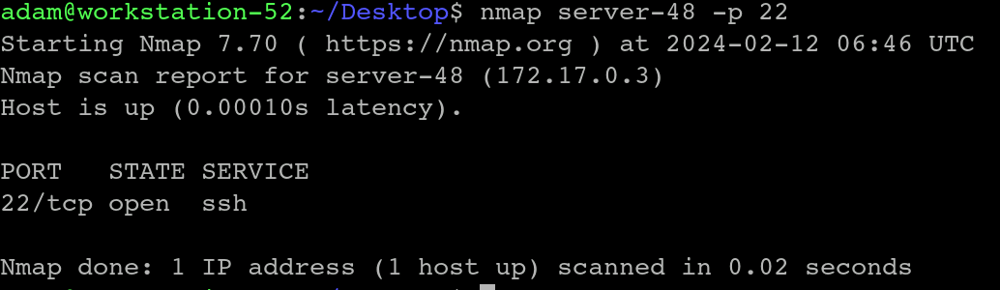
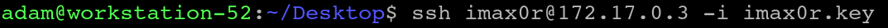
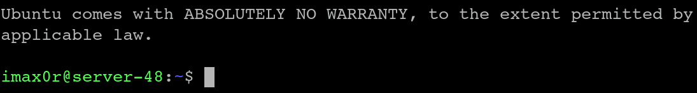
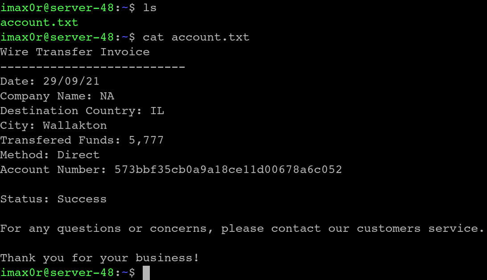

# Knock Knock
## Challenge Description:
During an internal audit in the Atlantic United bank, a suspicion arose that one of the IT department employees of the bank was siphoning funds to an offshore account.  
In a preliminary investigation, suspicious SSH traffic was detected originating from the employee's laptop to an undocumented machine in one of the bank's internal networks.  
When the internal investigation team scanned the undocumented machine, they could not detect any open ports despite the traffic. However, they found an SSH private key on the employee's laptop backups.  
The CTO of the bank asked to examine the situation further and find a way to access the machine.  
To assist you, the bank provided you with the employee's private SSH key and a "pcap" file containing the traffic between the employee's laptop and the undocumented machine that the IDS captured. 

#### Your goals are:
☛ To investigate the machine with the hostname 'server-48', you were provided with a Debian machine in the same local network. In case you will be locked out from the Debian machine, the username ‘adam' and the password 'r3s3arch3r' can be used to log in back to it. 
☛ Analyze the pcap file. 
☛ Discover how to log in as the user ‘imaxor' to the SSH service. 
☛ Read the text file containing the offshore account number. 

## Process:
When we open the machine, we will have a Wireshark and console windows. 
<kbd align="center">
  
</kbd> 
  

Use the search option in Wireshark in order to filter out the logs.  
#### ip.addr == 192.168.9.6 && ip.addr == 192.168.9.3
<kbd align="center">
  
</kbd> 
  

Our targets are in the red, sourced from the '192.168.9.3' to '192.168.9.6'.  
We will perform a knock with the ip of the 'server-48'.  
<kbd align="center">
  
</kbd> 
  

Check if it worked. run 'nmap server-48 -p 22'. 
<kbd align="center">
  
</kbd> 
  
If you see the state as open, you did everything as you should have. 

Now that it is open to us, we will use the 'imax0r.key' to access the server through SSH. 
<kbd align="center">
  
</kbd> 

<kbd align="center">
  
</kbd> 
  

Now that we are in, all there is left to do is to read the txt file  containing the offshore account number. 

 
        
The hidden flag
 
          <kbd align="center">
  
</kbd> 
    

