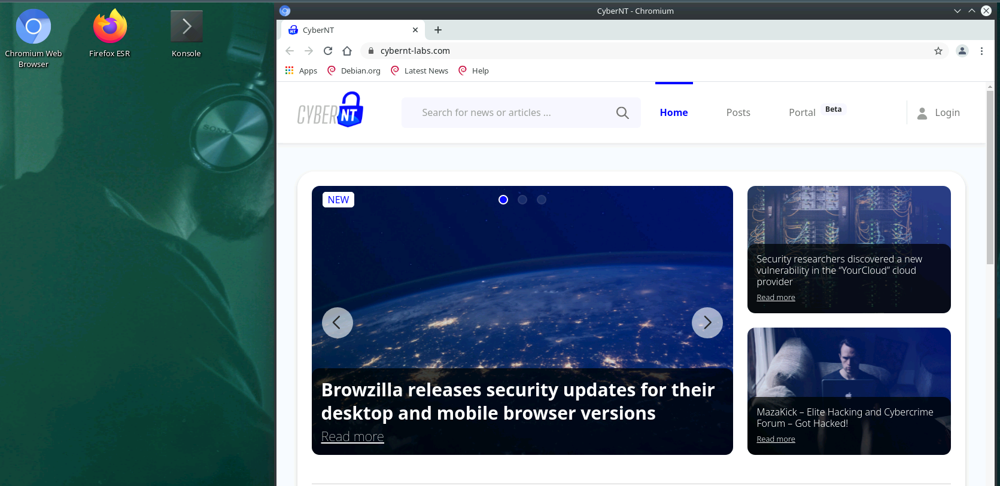
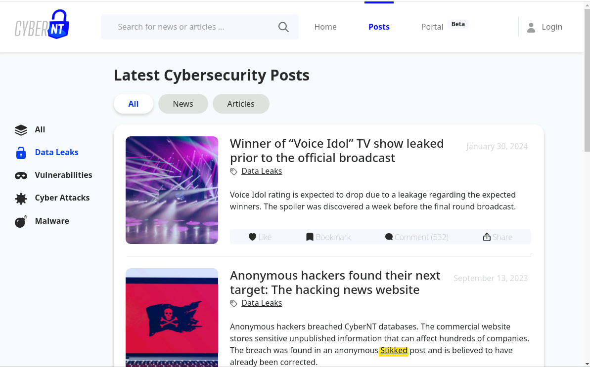
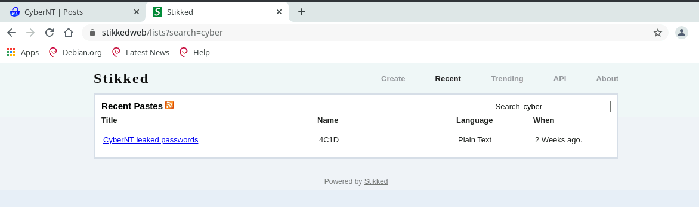
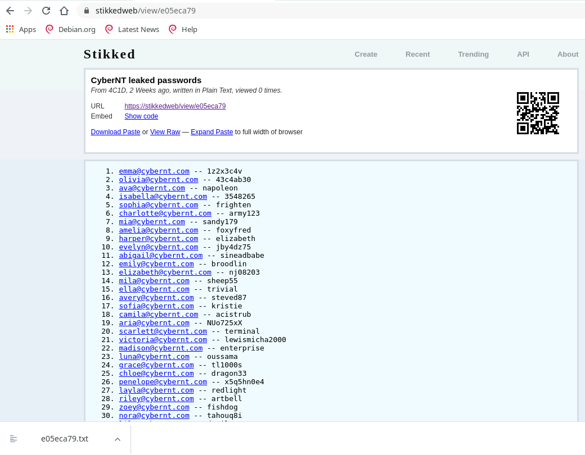
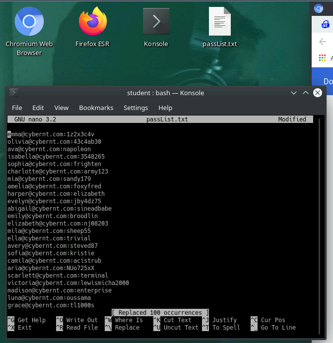

# Oh My Data
## Challenge Description:
"CyberNT" is a large journalism company that reports the latest cybersecurity news.  
Several months ago, the company discovered that its website was hacked and are sure that data was leaked.  
However, they are not certain which accounts were compromised and therefore took measures to secure as many accounts as possible.  
To be on the safe side, they hired you, a cybersecurity specialist, to verify that the incident was mitigated properly. 

#### Your goals 
☛ You were provided with the user and password 'student:CyberNT88#!' to reconnect if needed. 
☛ Use OSINT to locate the leaked credentials. 
☛ Determine if any account is still compromised. 

## Process:
When we start the machine we will be presented with this desktop, with this site already open
 
<kbd align="center">
  
</kbd> 
  
Lets examine the 'Ports' section of the site to see if we can find anything of use there. In the video we saw the name 'stikked' mentioned in an HTML script, so we should keep a lookout for that name. 

If we go to the news section and to 'Data Leaks', we will see that very name mentioned as a link.  
 <kbd align="center">
  
</kbd> 
  
Clicking it will direct us to their site. There we can search for the name 'CyberNT' as that is the name of the hacked site. 
 <kbd align="center">
  
</kbd> 
  
This will reveal a list of leaked email accounts and their passwords. 
 <kbd align="center">
  
</kbd> 
  
Download th
 <kbd align="center">
  
</kbd> 
  
We will download this as a txt file. Edit the text file with 'nano' and replace all "--" with ":", so it will be more compatible with Hydra. 

Finally, we will use Hydra to brute-force all the users to find at least one that wasn't disabled and can still access the site 

hydra -C list.txt cybernt-labs.com -s 443 https-post-form "/api/login:email=^USER^&pass=^PASS^:your account has been disabled" -V 
