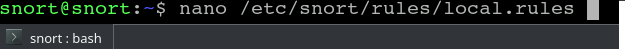
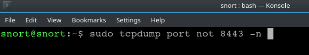
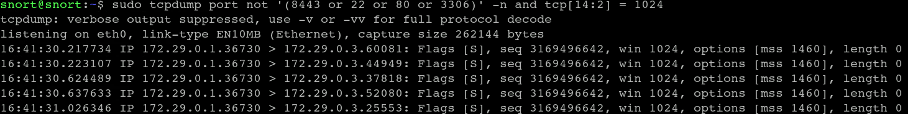
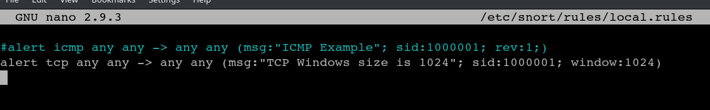
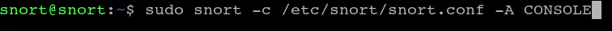
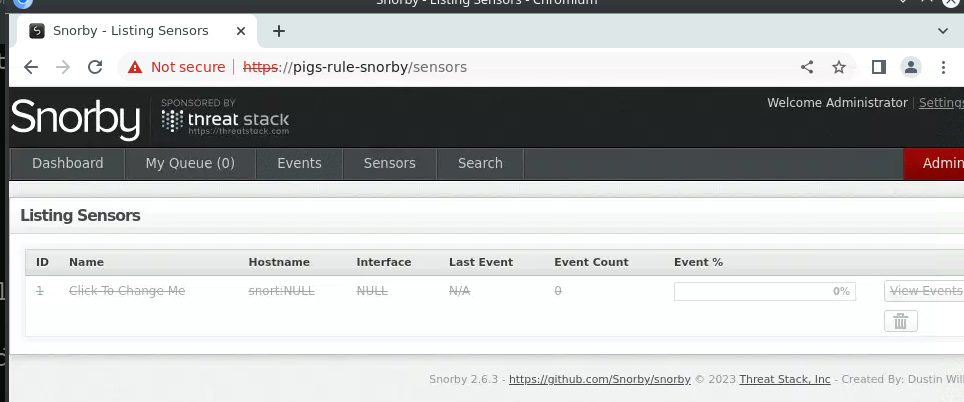

##### Note - I no longer have access to the TDX Arena site so I apologise if the images aren't very clear. This is one of the first guides I wrote so I apologise for it being less than stellar
##### Also that note that when I did this there was a bug that prevented the flag from showing
# Pigs Rules
#### Snort, TCPdump, alerting
## Challenge Description:
As a SOC analyst in the "Flying Piglet" post office, you gained intel about Hacktivists throughout the globe who plan to launch a hacking campaign against your country. 
To stay ahead, you are required to sniff the ongoing incoming traffic, identify the malicious traffic, and configure Snort IDS rules accordingly. 
The rules must not capture any legitimate traffic. 
Your goals:

#### Your goals 
☛ You are provided with the user and password 'snortoinko1nk" to reconnect if needed. Snorby Credentials:snorby@example.com:snorby 
☛ Sniff incoming traffic using TCPdump and identify malicious traffic. 
☛ Create a custom Snort rule to alert for malicious traffic. 
☛ Read the flag in the Snorby GUI, if Snort was configured correctly. 

## Process:
Login with the given credentials.  
We will need to add the relevant rules for this challenge. They can be found in '/etc/snort/rules/local.rules' 
 
<kbd align="center">
  
</kbd> 
  
Let's run 'netstat -a'. 
Now we will start running 'sudo tcpdump' and start filtering out all the legitimate looking ports, such as 8443, 22, 80, 3306. 
We'll use the command "sudo tcpdump port not '(8443 or 22 or 80 or 3306)' -n" 
 
<kbd align="center">
  
</kbd> 

Let's modify it to "sudo tcpdump port not '(8443 or 22 or 80 or 3306)' -n | grep 1024" to show all ports that contain the 1024 size
We will notice that port 36730 repeats itself over and over again.
 
<kbd align="center">
  
</kbd> 
 
Now let's edit the Snort rules in order to filter what we need.  
Use 'nano /etc/snort/rules/local.rules' to access the rules file for Snort.  
'alert tcp any any -> any any (msg:"TCP Windows size is 1024"; sid:1000001; window:1024;)'
 
<kbd align="center">
  
</kbd> 
 
And now we'll run the following command
 
<kbd align="center">
  
</kbd> 
 
The flag should appear in the 'Sensors' tab, but there is currently an issue that prevents this from happening
 
<kbd align="center">
  
</kbd> 
 

 
        
The Hidden Flag
 
          
 
            
Did you find the flag yourself?
 
          
 
            
I sure hope you did
 
                1fdcf70d937c1d1796a53fb4fdb9e79c
    
 
    
 
    
 
