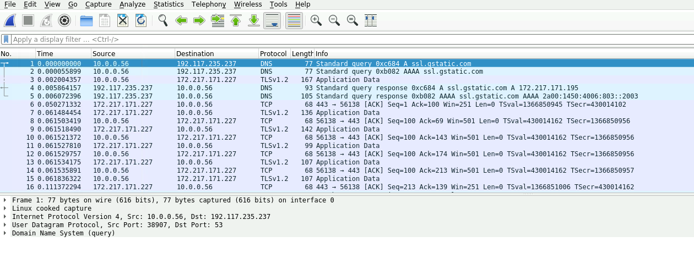
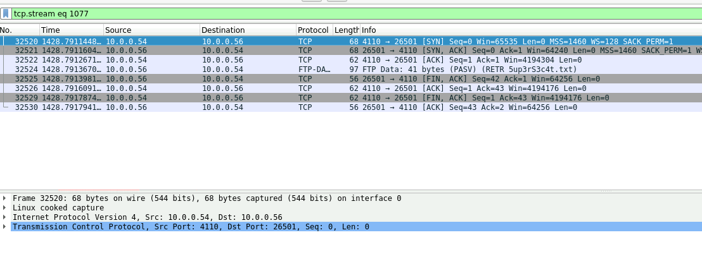
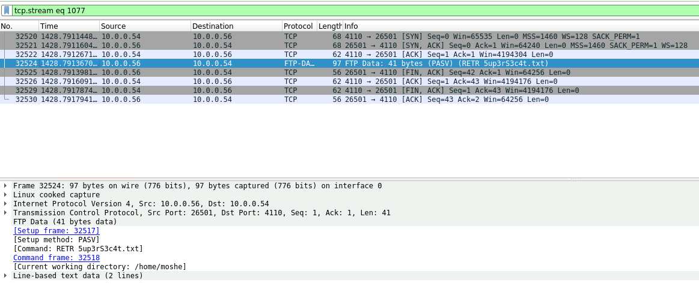
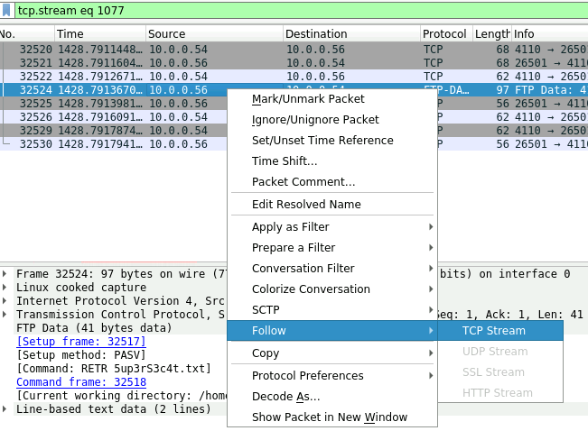
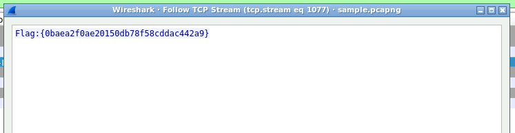

# Shark On The Watch
## Challenge Description:
During a coffee break, your colleague, Boris, teased you and said that he managed to hack your computer earlier that day and planted a hidden file in it.  
Since you always lock you computer when you leave, you suspect he did it using a network-related vulnerability. Luckily, company policy includes network traffic monitoring.  
The NOC team agreed to provide you with access to the recorded traffic of your computer on the same morning. 

#### Your goals are:
☛ Identify what Boris did to hack your computer. 
☛ Find the content of the file that Boris planted on your computer. 

## Process:
When we start the challenge we will be presented with an open 'Wireshark' GUI with several hundreds if not more logs, one of which will contain the flag.  
<kbd align="center">
  
</kbd> 
  
If you want to look up everything by youself, you can go ahead. 

 
        
Rest of the process
 
In the search bar, type in 'tcp.stream eq 1077'. 
 
<kbd align="center">
  
</kbd> 
  
You can now see several different logs. One of them has the flag.  
 
<kbd align="center">
  
</kbd> 
  

This is the one we need  
 
<kbd align="center">
  
</kbd> 
  

 
        
The hidden flag
 
          <kbd align="center">
  
</kbd> 
  
          0baea2f0ae20150db78f58cddac442a9
    

